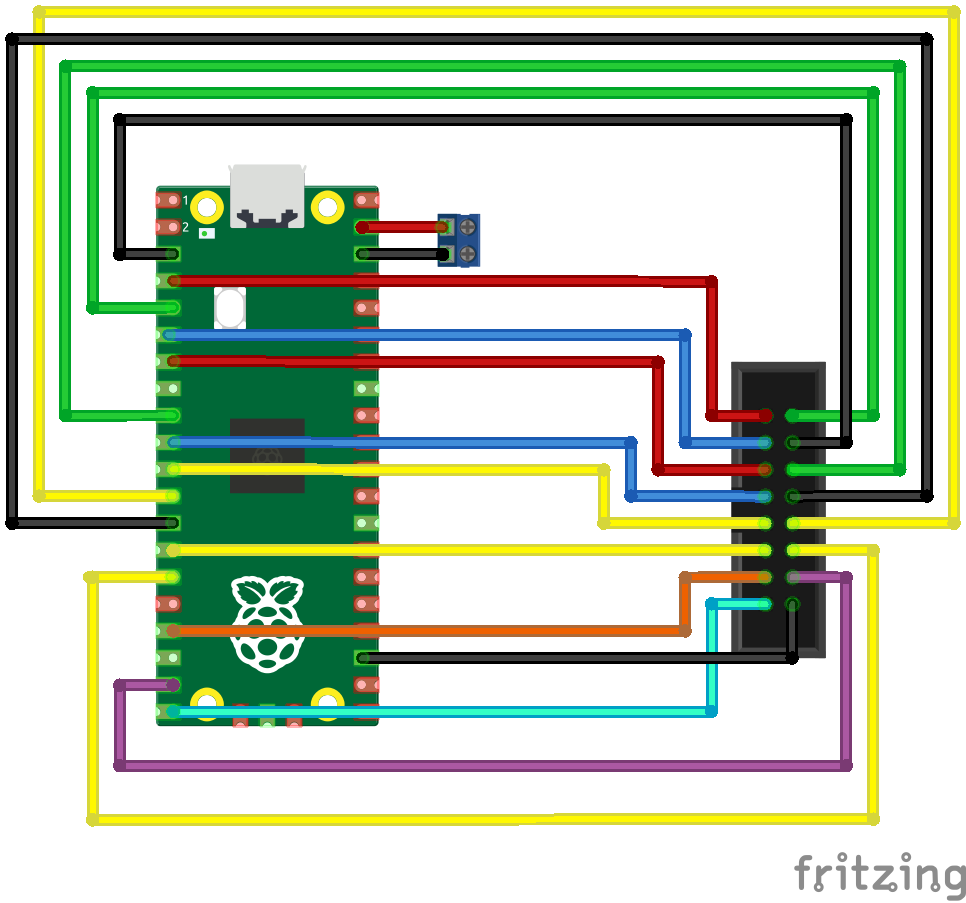

# Raspberry Pi Picoで光らせるLED方向幕

## ハードウェア構成

必要なもの:
- 5V 4A電源
- LEDマトリクス (32x64) 2枚
- Raspberry Pi Pico
- ジャンパ線 (メス - メス) 18本


### 配線
この配線は一例です。LEDマトリクスによってHUB75のpinoutが違う場合もあるようなので、必ず配線の際はデータシートを確認してください！
- HUB75 R1   <=> GPIO2
- HUB75 G1   <=> GPIO3
- HUB75 B1   <=> GPIO4
- HUB75 R2   <=> GPIO5
- HUB75 G2   <=> GPIO6
- HUB75 B2   <=> GPIO7
- HUB75 A    <=> GPIO8
- HUB75 B    <=> GPIO9
- HUB75 C    <=> GPIO10
- HUB75 D    <=> GPIO11
- HUB75 CLK  <=> GPIO13
- HUB75 LAT  <=> GPIO14
- HUB75 OE   <=> GPIO15
- 5V 電源入力 <=> VSYS



## ソフトウェア構成

必要なもの:
- Pico SDK
- CMake / make
- Python
  - PILライブラリを使用しているので、インストールがまだであればインストールしてください。


## 動作手順

### 画像の準備

1. リポジトリのルート階層に`images`フォルダを作成します。
2. `images`フォルダ内にPNGファイルを配置します。
   - 画像サイズ - PNGファイルはLEDマトリクスのサイズと同じ**32 x 128**である必要があります。
   - 画像の順番 - 画像はPNGファイル名のアルファベット順に表示されます。
   - 最大枚数 - 各画像は 32bit/px x 32行 x 128列 = 16KBの大きさです。Raspberry Pi Picoのフラッシュは2MBなので、単純計算だと最大128枚の画像が保存できます。ただし、プログラム自体もフラッシュに書かれるため、実際には128枚より少ない枚数が最大となります。90枚程度であれば問題ないことは確認しています。

### コンパイル
リポジトリのルート階層に`build`フォルダを作成し、`build`フォルダ内に移動します。
```bash
mkdir build
```
```bash
cd build
```

`cmake`と`make`を実行します。
```bash
cmake ..
```
```bash
make
```
`make`の実行がエラーなく終われば、`build/src`フォルダ内に`pico_led_houkoumaku.uf2`が作成されます。


### 実行
Raspberry Pi PicoをBOOTSELモードでPCに接続し、先ほど作成したUF2ファイルをコピーします。
コピーが終わるとPicoが勝手に再起動し、LEDマトリクスが点灯するはずです。


## 調整
### 明るさ
[`src/main.c`](src/main.c)内の以下の値を変更することでLEDの明るさを変えられます。点灯時間(Output Enable時間)の長さを調整しているため、あまり長く設定(>200)しすぎるとちらつきが発生し始めます。私の環境では100以上に設定しても明るさが頭打ちだったこともあるので、1 ~ 100の間で設定するのがいいかと思います。
```C
#define BRIGHTNESS 50
```

### 画像変更間隔
[`src/main.c`](src/main.c)内の以下の値を変更することで画像の変更間隔を変えられます。単位はマイクロ秒です。
```C
#define FRAME_DURATION 3000000  // In microseconds
```